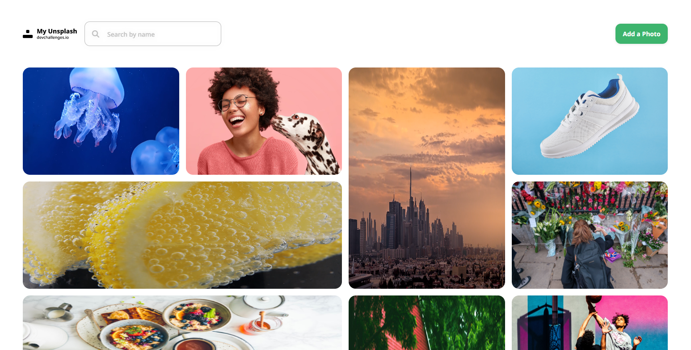
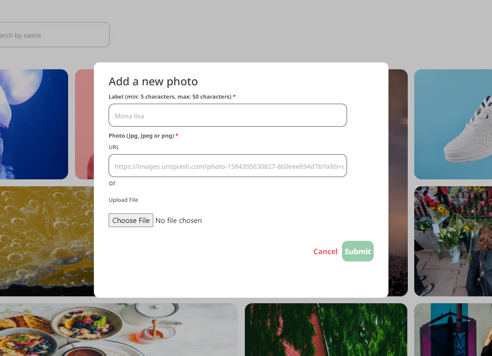
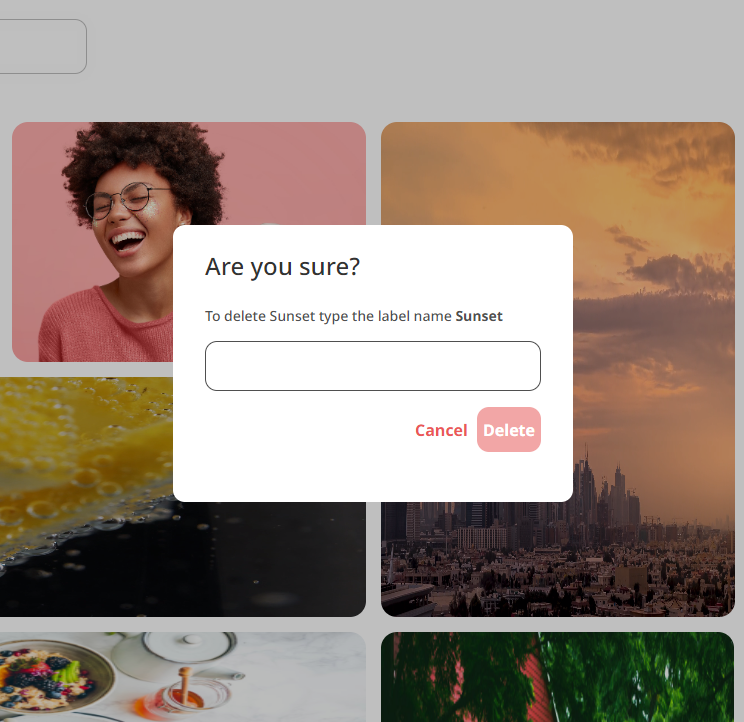

<h1 align="center">My unsplash</h1>

<div align="center">
  <h3>
    <a href="https://my-unsplash-client.vercel.app/">
      Demo
    </a>
    <span> | </span>
    <a href="https://github.com/Bluebberies/my-unsplash-fullstack-project">
      Solution
    </a>
  </h3>
</div>

## Table of Contents

- [Overview](#overview)
  - [Built With](#built-with)
- [Features](#features)
- [How to use](#how-to-use)
- [Contact](#contact)

## Overview





### Built With

- [React](https://reactjs.org/)
- [Node](https://Nodejs.org/)
- [Cloudinary]

## Features

An unsplash project where you can see a collection of images, update them and delete them

## How To Use

<!-- Example: -->

To clone and run this application, you'll need [Git](https://git-scm.com) and [Node.js](https://nodejs.org/en/download/) (which comes with [npm](http://npmjs.com)) installed on your computer. From your command line:

```bash
# Clone this repository
$ git clone https://github.com/your-user-name/your-project-name

# Install dependencies
$ npm install

# Run the app
$ npm start
```
## Contact

- LinkedIn [@Francis-Okonkwo](https://www.linkedin.com/in/francis-okonkwo-51a388232/)
- Twitter [@fran__cies](https://twitter.com/fran__cies)
- Facebook [@Fran Cis](https://web.facebook.com/francis.okonkwo.946517)
- Instagram [@fran__cies](https://www.instagram.com/fran__cies/)
- GitHub [@Bluebberies](https://{github.com/Bluebberries)